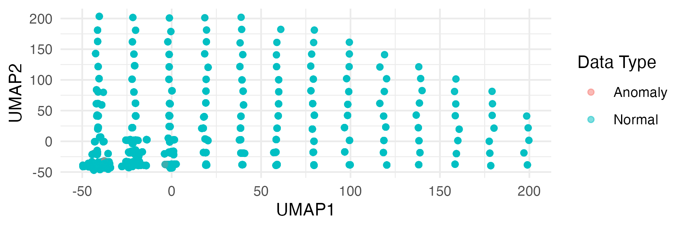

\newpage

```{r setup, include=FALSE}
  
knitr::opts_chunk$set(echo = TRUE)
require(tidyverse)
library(patchwork)
library(vcd)
library(reshape2)
library(xgboost)
library(solitude)
library(umap)
library(caret)
library(proxy)
library(class)
library(pROC)
library(knitr)
library(glmnet)
```


```{r, include = FALSE}
knitr::opts_chunk$set()
```

# Introduction

  This data set comprises details of simulated samples associated with 
  23 species of gilled mushrooms from the Agaricus and Lepiota Family. 
  Each species is categorized as either definitely edible, 
  definitely poisonous, or of unknown edibility and thus, not advised for 
  consumption. The latter category is subsumed under definitely inedible,
  thereby defining a binary classification problem. The idea is to use the 
  mushrooms qualitative characteristics to identify it as edible or not. 
  This data set is sourced from the machine learning repository 
  \cite{misc_mushroom_73}. 
  
  
```{r, echo = FALSE}
set.seed(123)

data <- read.csv("agaricus-lepiota.data", header = FALSE)

#Missing colnames
column_names <- c("poisonous","cap-shape", "cap-surface", "cap-color", 
                  "bruises", "odor", 
                  "gill-attachment", "gill-spacing", "gill-size", "gill-color", 
                  "stalk-shape", "stalk-root", "stalk-surface-above-ring", 
                  "stalk-surface-below-ring", "stalk-color-above-ring", 
                  "stalk-color-below-ring", "veil-type", "veil-color", 
                  "ring-number", "ring-type", "spore-print-color", "population", 
                  "habitat")

# Assign these names to dataframe
colnames(data) <- column_names

# Remove variable with NA's
data <- data %>% select(-`veil-type`)

# Make features into factor variables
data_numeric <- as.data.frame(lapply(data, 
                function(x) as.numeric(as.factor(x)))) 

train_indices <- sample(1:nrow(data_numeric), nrow(data_numeric)*0.7)
train_data <- data_numeric[train_indices, ]
test_data <- data_numeric[-train_indices, ]

train_labels <- train_data$poisonous - 1 
test_labels <- test_data$poisonous - 1

# Remove the label from train_data and test_data
train_data <- train_data[, -which(names(train_data) == "poisonous")]
test_data <- test_data[, -which(names(test_data) == "poisonous")]
```


```{r, echo = FALSE}

model <- xgboost(data = as.matrix(train_data), 
                 label = train_labels, 
                 nrounds = 100, 
                 objective = "binary:logistic", 
                 verbose = 0)
importance <- xgb.importance(feature_names = colnames(train_data),
                             model = model)
top_features <- importance %>%
                filter(Feature != "gill.size") %>%
                filter(Feature %in% c("gill.color", "spore.print.color", 
                                      "population", "odor", 
                        "stalk.color.above.ring", "habitat"))
top_features <- top_features$Feature

p1 <- xgb.ggplot.importance(importance) + ggplot2::labs(title = NULL)

# Applying feature selection
train_data_selected <- train_data %>%
  select(all_of(top_features))
test_data_selected <- test_data %>%
  select(all_of(top_features))


```

```{r, echo = FALSE}

#Correlation Analysis 

  # Remove predictor 

  data2 <- train_data_selected

  # Create an empty matrix to store Cramér's V values
  n <- ncol(data2)
  cramer_matrix <- matrix(0, n, n)
  colnames(cramer_matrix) <- colnames(data2)
  rownames(cramer_matrix) <- colnames(data2)
  
  # Loop through all pairs of variables
  for (i in 1:n) {
    for (j in 1:n) {
      # Skip the diagonal (variable with itself)
      if (i != j) {
        table_data <- table(data2[, i], data2[, j])
        cramers_v <- assocstats(table_data)$cramer
        cramer_matrix[i, j] <- cramers_v
      }
    }
  }
  
  
  # Melt the matrix for ggplot2
  melted_matrix <- melt(cramer_matrix)
  
  p2 <- ggplot(melted_matrix, aes(Var1, Var2, fill=value)) +
    geom_tile() +
    scale_fill_gradient2(low="blue", mid="white", high="red", midpoint=0.5) +
    theme_minimal() +
    labs(title= NULL, x="Feature 1", y="Feature 2", 
         fill="Cramér's V") +
    theme(axis.text.x = element_text(angle = 45, hjust = 1))
  
  
# Define function to extract pairs of features that exceed threshold in 
  # cramer matrix

  extract_high_assoc <- function(cramer_matrix, threshold) {
    # Obtain indices where Cramer's V exceeds threshold
    high_assoc_ind <- which(cramer_matrix > threshold, arr.ind = TRUE)
    
    # Convert matrix indices to column names
    high_assoc_pairs <- apply(high_assoc_ind, 1, function(idx) {
      c(rownames(cramer_matrix)[idx[1]], colnames(cramer_matrix)[idx[2]])
    }) 
  
    # Remove duplicated pairs and self-associations (pair[1] == pair[2])
  high_assoc_pairs <- unique(t(high_assoc_pairs))
  high_assoc_pairs <- high_assoc_pairs[high_assoc_pairs[,1] != 
                                         high_assoc_pairs[,2], ]
    
    # Convert matrix to list of pairs
    #pair_list <- apply(high_assoc_pairs,1, function(pair) {
    #  list(pair[1], pair[2])
    #})
    
   # return(pair_list)
  high_associations_df <- as.data.frame(high_assoc_pairs)
  colnames(high_associations_df) <- c("Feature_1", "Feature_2")
  rownames(high_associations_df) <- NULL
  return(high_associations_df)

  }
  
threshold_value = 0.5
high_associations <- extract_high_assoc(cramer_matrix, threshold_value)
```

```{r, echo = FALSE, eval = FALSE,include=FALSE}
# Train Isolation Forest on training data
iso_forest <- isolationForest$new()
iso_forest$fit(train_data_selected)
scores.iso_train <- iso_forest$predict(train_data_selected)
scores.iso_test <- iso_forest$predict(test_data_selected)
train_scores <- scores.iso_train$anomaly_score
threshold <- quantile(train_scores, 0.99)
anomalies <- which(train_scores > threshold)


# UMAP transformation on training data
umap_model_train <- umap(train_data_selected, n_neighbors = 5, min.dist = 0.01)

umap_data <- as.data.frame(umap_model_train$layout)
colnames(umap_data) <- c("UMAP1", "UMAP2")
umap_data$is_anomaly <- ifelse(rownames(umap_data) %in% anomalies,
                               "Anomaly", "Normal")

p3 <- ggplot(umap_data, aes(x = UMAP1, y = UMAP2, color = is_anomaly)) +
  geom_point(alpha = 0.5) +
  theme_minimal() +
  labs(title = NULL, color = "Data Type")

# have to save file as islationForest messages cant be turned off
#ggsave(filename = "umap.png", plot = p3, width = 6, height = 2)
```

```{r p1, echo = FALSE, fig.height= 3, fig.width= 8, fig.cap = "Feature importance by Xtreme Gradient Boosting training and a heatmap of Cramer's V statistic for the features selected by xgboost."}
p1+p2
```

# Methodology

  The 22 categorical features are transformed into integer
  factor variables. One 
  feature, `veil-type`, was removed as it had many NA's (30%) and it 
  had very low importance as determined  below. No other features had missing
  values. 
  The data is split into a training and test
  set. We use `xgboost::xbg.train()` to perform feature selection on the
  training data and subset in accordance with the 
  results (Figure \ref{fig:p1}) . The sub-setted training data is checked for
  collinearity via Cramer's V statistic. The top 10 most important 
  features were cross referenced with the Cramers V statistic and
  features greater than a threshold of $0.5$ were removed (Figure \ref{fig:p1}).
 
  We used `silence::isolationForests` to detect outliers in the data. It 
  provides a score for each data point indicating how anomalous it is. We
  classify a point as analomous if it has a $score > 0.99$. This resulted in 48
  potential outliers. This high dimensional data is vizualized using
  Uniform Manifold Approximation and Projection (UMAP) via `umap::umap`
  (Figure \ref{fig:p2}). None of the analomous points appear outside the main
  cluster so none were excluded. 
  
  In total there are 6 features and 8124 observations.
  
  
```{r p2, echo = FALSE, fig.cap = "Low dimensional approximation of data by UMAP and classified according to anomalousness via isolation forests."}

```


# Data Splitting

The data was split into training and test data using random sampling in a
(70/30) split. It was done before pre-processing to ensure there was no
data leakage. This resulted in $5686$ training observations and $2438$
test observations. 

# Model Fitting

KNN does not work for categorical features using the
euclidean distance metric because it does not make sense to take the distance of
integer valued categories when the ordinal ranking has no meaning. This can
be overcome in two steps. First the data is one-hot encoded to create numeric
valued features. This means each level of each feature is transformed 
into a binary variable. Then the jaccard metric is used instead of the euclidean
metric. It is defined as the distance between two sets, $A$ and $B$ as
$$D_J(A, B) = 1 - \frac{|A \cap B|}{|A \cup B|}.$$
This custom distance function is specified using `kknn:train.kknn`.
This function automatically performs cross-validation for the the number of 
neighbors `k`. 

kNN is a non-parametric algorithm, meaning that it is based on the entire data
and not parameters estimated from the data. The observation of each observation
is determined by its "neighbors" and therefore all features play a role. 
The model does not rank them. On the other hand we can see from 
(Figure \ref{fig:p1}) that xgboost ranks `gill.color` as the most important
feature. 

Logistic regression is a parametric method and we can compare magnitude
of estimated coefficients with the corresponding statistical significance.
Prioritizing magnitude `population` is the most important feature and
prioritizing statistical significance `gill.color` is the most important
feature. Both are easily observable traits of a mushroom for an expert 
picking them. Since `gill.color` is the most important in both methods we can
look at its interpretation as follows. The coefficient for 
gill.color is $-0.388$. This means that for a one-unit increase in 
`gill.color`, the log odds of the dependent variable occurring decrease by 
$0.3884028$ units, holding all else constant. The odds ratio
for `gill.color` would be $e^{-0.388}$, which is less than $1$. This implies 
that as `gill.color` increases by one unit, the odds of the event (edible)
occurring decrease. 


```{r, echo = FALSE}
# One hot encode features
dummy_train <- dummyVars(" ~ .", data= train_data_selected)
dummy_test <- dummyVars(" ~ .", data= test_data_selected)

onehot_train <- data.frame(predict(dummy_train, newdata =train_data_selected)) 
onehot_test <- data.frame(predict(dummy_test, newdata =test_data_selected))

```


```{r, echo = FALSE}
# Define jaccard function

jaccard_dist <- function(a, b) {
    intersection = sum(a & b)
    union = sum(a | b)
    if (union == 0) return (0) # to avoid division by zero
    return (1 - intersection/union)
}
knn_model_jaccard <- kknn::train.kknn(formula = train_labels ~ .,
                                      data = data.frame(onehot_train, 
                                                  train_labels = train_labels),
                                      kmax = 21,
                                      distance = 1, 
                                      kernel = "optimal",
                                      scale = FALSE,
                                      customDist = jaccard_dist)

knn_predictions <- predict(knn_model_jaccard, newdata = onehot_test)

knn_predictions <- factor(knn_predictions, levels = c(0, 1))
test_labels <- factor(test_labels, levels = c(0, 1))

knn_conf_matrix <- confusionMatrix(knn_predictions, test_labels)

```


```{r, echo = FALSE}
# Convert features to factors
train_labels <- as.factor(train_labels)
test_labels <- as.factor(test_labels)

logistic_model <- train(onehot_train, train_labels, 
                        method = "glm", 
                        family = "binomial",
                        trControl = trainControl(method = "cv", number = 5),
                        metric = "Accuracy")

log_predictions <- predict(logistic_model, newdata = onehot_test)
log_conf_matrix <- confusionMatrix(log_predictions, test_labels)

```

```{r, echo = FALSE}
coef_summary <- summary(logistic_model$finalModel)
```

```{r, echo = FALSE}
# For kNN with Jaccard
knn_misclass_error <- 1 - knn_conf_matrix$overall['Accuracy']

# For Logistic Regression
log_conf_matrix <- confusionMatrix(log_predictions, test_labels)
logistic_misclass_error <- 1 - log_conf_matrix$overall['Accuracy']


```

```{r, echo = FALSE}
# Get predicted probabilities for the positive class
logistic_probs <- predict(logistic_model, newdata = onehot_test, 
                          type = "prob")$`1`

# Compute ROC curve
roc_obj <- suppressMessages(roc(test_labels, logistic_probs))

# Find optimal cutoff using Youden's Index
cutoff <- coords(roc_obj, "best")

predicted_probs <- predict(logistic_model, newdata = onehot_test, type = "prob")

predicted_labels <- ifelse(predicted_probs[,2] >= cutoff$threshold, 1, 0)
predicted_labels <- factor(predicted_labels, levels = c(0, 1))
conf_matrix <- confusionMatrix(predicted_labels, test_labels)

```

#  Model Analysis and Comparison

\begin{table}[h]
\centering
\caption{Classification Comparison}
\begin{tabular}{|l|c|c|}
\hline
\textbf{Metric} & \textbf{Logistic Regression} & \textbf{kNN} \\
\hline
Accuracy & $0.8404$ & $1.0000$ \\
\hline
Kappa & $0.6761$ & $1.0000$ \\
\hline
Pos Pred Value (Class 0) & $0.7899$ & $1.0000$ \\
\hline
Neg Pred Value (Class 0) & $0.9282$ & $1.0000$ \\
\hline
\end{tabular}
\label{tab:classification_comparison}
\end{table}

There is distinct performance differences between the two classifiers.
The first classifier achieves an
accuracy of $0.8404$ with a $\kappa$ statistic of $0.6761$, indicating
moderate agreement beyond chance. At the computed threshold of $0.6901$,
the specificity of the model is approximately $0.9502$, 
meaning that it correctly identifies about $95.02 \%$ of the negative 
instances as negative.  At the same threshold, the sensitivity of the model
is approximately $0.7179$, meaning that it correctly identifies
about $71.79 \%$ of the positive instances as positive. The classifier 
thus performs relatively well, but there's a notable trade-off between
sensitivity and specificity. 
Conversely, the knn classifier achieves a perfect accuracy of 
1 with a $\kappa$ of 
1 signifying total agreement. Its sensitivity and specificity are both 
1, implying no errors in classification. 

# Logistic Regression with Shrinkage

```{r, echo = FALSE}
X_train <- as.matrix(train_data_selected)
y_train <- train_labels

cv.lasso <- cv.glmnet(X_train, y_train, family="binomial", alpha=1)

best_lambda <- cv.lasso$lambda.min

X_test <- as.matrix(test_data_selected)
y_test <- test_labels

# Predict on the test set using the best lambda
lasso_probs <- predict(cv.lasso, s = best_lambda, newx = X_test,
                       type = "response")

# Convert probabilities to binary predictions
lasso_preds <- ifelse(lasso_probs > 0.5, 1, 0)

# Measure performance
accuracy_lasso <- mean(lasso_preds == y_test)
```

The best shrinkage value is $\lambda = 8.3 \times 10^{-4}$. Without shrinkage
every coefficient in the data set will get a coefficient.  With lasso shrinkage
some coefficients get shrunk to zero by penalizing the coefficients. The
accuracy of the lasso model is $81.16 \%$, which is less than without
shrinkage.

# Conclusion

kNN is able to predict whether a mushroom is edible or not based off of
six easily observable characteristics with $100 \%$ accuracy. It is a more 
flexible algorithm as it makes no assumptions about the functional form
of the decision boundary, instead it uses local information
based on the nearest data points in the feature space. On the other hand 
logistic regression is a global method and finds a single boundary to
separate classes. Since we carefully pre-processed the data to include 
only the most important features, it enabled us to take advantage of
the flexibility of kNN by avoiding the curse of dimensionality. 


\newpage

# Supplemntary Material 

```{r}
# Packages

knitr::opts_chunk$set(echo = TRUE)
require(tidyverse)
library(patchwork)
library(vcd)
library(reshape2)
library(xgboost)
library(solitude)
library(umap)
library(caret)
library(proxy)
library(class)
library(pROC)
library(knitr)
library(glmnet)

# Data tidying

set.seed(123)

data <- read.csv("agaricus-lepiota.data", header = FALSE)

#Missing colnames
column_names <- c("poisonous","cap-shape", "cap-surface", "cap-color", 
                  "bruises", "odor", 
                  "gill-attachment", "gill-spacing", "gill-size", "gill-color", 
                  "stalk-shape", "stalk-root", "stalk-surface-above-ring", 
                  "stalk-surface-below-ring", "stalk-color-above-ring", 
                  "stalk-color-below-ring", "veil-type", "veil-color", 
                  "ring-number", "ring-type", "spore-print-color", "population", 
                  "habitat")

# Assign these names to dataframe
colnames(data) <- column_names

# Remove variable with NA's
data <- data %>% select(-`veil-type`)

# Make features into factor variables
data_numeric <- as.data.frame(lapply(data, 
                function(x) as.numeric(as.factor(x)))) 

train_indices <- sample(1:nrow(data_numeric), nrow(data_numeric)*0.7)
train_data <- data_numeric[train_indices, ]
test_data <- data_numeric[-train_indices, ]

train_labels <- train_data$poisonous - 1 
test_labels <- test_data$poisonous - 1

# Remove the label from train_data and test_data
train_data <- train_data[, -which(names(train_data) == "poisonous")]
test_data <- test_data[, -which(names(test_data) == "poisonous")]

#Feature Selection


model <- xgboost(data = as.matrix(train_data), 
                 label = train_labels, 
                 nrounds = 100, 
                 objective = "binary:logistic", 
                 verbose = 0)
importance <- xgb.importance(feature_names = colnames(train_data),
                             model = model)
top_features <- importance %>%
                filter(Feature != "gill.size") %>%
                filter(Feature %in% c("gill.color", "spore.print.color", 
                                      "population", "odor", 
                        "stalk.color.above.ring", "habitat"))
top_features <- top_features$Feature

print(top_features)

p1 <- xgb.ggplot.importance(importance) + ggplot2::labs(title = NULL)

# Applying feature selection
train_data_selected <- train_data %>%
  select(all_of(top_features))
test_data_selected <- test_data %>%
  select(all_of(top_features))

#Correlation Analysis 

  # Remove predictor 

  data2 <- train_data %>% 
          select(all_of(importance$Feature[1:10]))

  # Create an empty matrix to store Cramers V values
  n <- ncol(data2)
  cramer_matrix <- matrix(0, n, n)
  colnames(cramer_matrix) <- colnames(data2)
  rownames(cramer_matrix) <- colnames(data2)
  
  # Loop through all pairs of variables
  for (i in 1:n) {
    for (j in 1:n) {
      # Skip the diagonal (variable with itself)
      if (i != j) {
        table_data <- table(data2[, i], data2[, j])
        cramers_v <- assocstats(table_data)$cramer
        cramer_matrix[i, j] <- cramers_v
      }
    }
  }
  
  
  # Melt the matrix for ggplot2
  melted_matrix <- melt(cramer_matrix)
  
  p2 <- ggplot(melted_matrix, aes(Var1, Var2, fill=value)) +
    geom_tile() +
    scale_fill_gradient2(low="blue", mid="white", high="red", midpoint=0.5) +
    theme_minimal() +
    labs(title= NULL, x="Feature 1", y="Feature 2", 
         fill="Cramér's V") +
    theme(axis.text.x = element_text(angle = 45, hjust = 1))
  
  
# Define function to extract pairs of features that exceed threshold in 
  # cramer matrix

  extract_high_assoc <- function(cramer_matrix, threshold) {
    # Obtain indices where Cramer's V exceeds threshold
    high_assoc_ind <- which(cramer_matrix > threshold, arr.ind = TRUE)
    
    # Convert matrix indices to column names
    high_assoc_pairs <- apply(high_assoc_ind, 1, function(idx) {
      c(rownames(cramer_matrix)[idx[1]], colnames(cramer_matrix)[idx[2]])
    }) 
  
    # Remove duplicated pairs and self-associations (pair[1] == pair[2])
  high_assoc_pairs <- unique(t(high_assoc_pairs))
  high_assoc_pairs <- high_assoc_pairs[high_assoc_pairs[,1] != 
                                         high_assoc_pairs[,2], ]
    
    # Convert matrix to list of pairs
    #pair_list <- apply(high_assoc_pairs,1, function(pair) {
    #  list(pair[1], pair[2])
    #})
    
   # return(pair_list)
  high_associations_df <- as.data.frame(high_assoc_pairs)
  colnames(high_associations_df) <- c("Feature_1", "Feature_2")
  rownames(high_associations_df) <- NULL
  return(high_associations_df)

  }
  
threshold_value = 0.5
high_associations <- extract_high_assoc(cramer_matrix, threshold_value)
print(high_associations)
# Train Isolation Forest on training data
iso_forest <- isolationForest$new()
iso_forest$fit(train_data_selected)
scores.iso_train <- iso_forest$predict(train_data_selected)
scores.iso_test <- iso_forest$predict(test_data_selected)
train_scores <- scores.iso_train$anomaly_score
threshold <- quantile(train_scores, 0.99)
anomalies <- which(train_scores > threshold)
print(anomalies)

# UMAP transformation on training data
umap_model_train <- umap(train_data_selected, n_neighbors = 5, min.dist = 0.01)

umap_data <- as.data.frame(umap_model_train$layout)
colnames(umap_data) <- c("UMAP1", "UMAP2")
umap_data$is_anomaly <- ifelse(rownames(umap_data) %in% anomalies,
                               "Anomaly", "Normal")

p3 <- ggplot(umap_data, aes(x = UMAP1, y = UMAP2, color = is_anomaly)) +
  geom_point(alpha = 0.5) +
  theme_minimal() +
  labs(title = NULL, color = "Data Type")

# have to save file as islationForest messages cant be turned off
ggsave(filename = "umap.png", plot = p3, width = 6, height = 2)

# One hot encode features
dummy_train <- dummyVars(" ~ .", data= train_data_selected)
dummy_test <- dummyVars(" ~ .", data= test_data_selected)

onehot_train <- data.frame(predict(dummy_train, newdata =train_data_selected)) 
onehot_test <- data.frame(predict(dummy_test, newdata =test_data_selected))

# Fit kNN

# Define jaccard function
jaccard_dist <- function(a, b) {
    intersection = sum(a & b)
    union = sum(a | b)
    if (union == 0) return (0) # to avoid division by zero
    return (1 - intersection/union)
}
knn_model_jaccard <- kknn::train.kknn(formula = train_labels ~ .,
                                      data = data.frame(onehot_train, 
                                                  train_labels = train_labels),
                                      kmax = 21,
                                      distance = 1, 
                                      kernel = "optimal",
                                      scale = FALSE,
                                      customDist = jaccard_dist)

knn_predictions <- predict(knn_model_jaccard, newdata = onehot_test)

knn_predictions <- factor(knn_predictions, levels = c(0, 1))
test_labels <- factor(test_labels, levels = c(0, 1))

knn_conf_matrix <- confusionMatrix(knn_predictions, test_labels)
print(knn_conf_matrix)
# Fit log model

# Convert features to factors
train_labels <- as.factor(train_labels)
test_labels <- as.factor(test_labels)

logistic_model <- train(onehot_train, train_labels, 
                        method = "glm", 
                        family = "binomial",
                        trControl = trainControl(method = "cv", number = 5),
                        metric = "Accuracy")

log_predictions <- predict(logistic_model, newdata = onehot_test)
log_conf_matrix <- confusionMatrix(log_predictions, test_labels)

# For kNN with Jaccard
knn_misclass_error <- 1 - knn_conf_matrix$overall['Accuracy']
print(knn_misclass_error)
# For Logistic Regression
log_conf_matrix <- confusionMatrix(log_predictions, test_labels)
logistic_misclass_error <- 1 - log_conf_matrix$overall['Accuracy']
print(logistic_misclass_error)
# Get predicted probabilities for the positive class
logistic_probs <- predict(logistic_model, newdata = onehot_test, 
                          type = "prob")$`1`

# Compute ROC curve
roc_obj <- suppressMessages(roc(test_labels, logistic_probs))

# Find optimal cutoff using Youden's Index
cutoff <- coords(roc_obj, "best")
print(cutoff)
predicted_probs <- predict(logistic_model, newdata = onehot_test, type = "prob")

predicted_labels <- ifelse(predicted_probs[,2] >= cutoff$threshold, 1, 0)
predicted_labels <- factor(predicted_labels, levels = c(0, 1))
conf_matrix <- confusionMatrix(predicted_labels, test_labels)
print(conf_matrix)

X_train <- as.matrix(train_data_selected)
y_train <- train_labels

cv.lasso <- cv.glmnet(X_train, y_train, family="binomial", alpha=1)

best_lambda <- cv.lasso$lambda.min
print(best_lambda)

X_test <- as.matrix(test_data_selected)
y_test <- test_labels

# Predict on the test set using the best lambda
lasso_probs <- predict(cv.lasso, s = best_lambda, newx = X_test,
                       type = "response")

# Convert probabilities to binary predictions
lasso_preds <- ifelse(lasso_probs > 0.5, 1, 0)

# Measure performance
accuracy_lasso <- mean(lasso_preds == y_test)
print(accuracy_lasso)
```

\newpage
